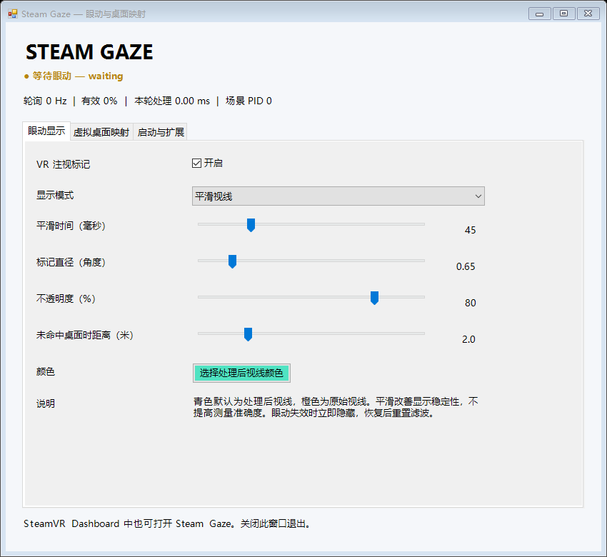

# Steam Gaze

**Experimental SteamVR gaze visualization and Desktop+ to Windows coordinate bridge.**

[中文说明](README.zh-CN.md) · [Extension protocol](EXTENSIONS.md) · [Changelog](CHANGELOG.md)

Steam Gaze reads the combined eye-gaze ray exposed through OpenVR, draws a marker in the headset, and maps intersections with a supported Desktop+ desktop surface to Windows physical pixels. It runs as an independent overlay alongside the scene application.

The initial setup uses PSVR2 with PSVR2Toolkit. Other eye-tracking drivers have not been tested. The current settings UI is in Simplified Chinese; the protocol and developer documentation are in English.



## Features

- Raw, smoothed, or simultaneous gaze markers; adjustable smoothing, color, opacity, angular size, and fallback distance.
- Head-local filtering followed by transformation into OpenVR standing space.
- SteamVR Dashboard controls, Windows settings, tray mode, and optional SteamVR autostart.
- Desktop+ ray intersections that account for its current position, rotation, size, crop and cylindrical curvature.
- Windows physical-pixel coordinates, including negative coordinates and gaps between monitors.
- Desktop preview, an optional click-through marker, and a 30-second mapping-check board.
- A versioned, current-user-only named pipe for downstream applications. No mouse movement or clicking.

## Requirements

- Windows x64 with .NET Framework 4.8 and a writable application directory.
- SteamVR with the OpenVR 2.15.6 eye-input API; tested with SteamVR 2.17.10.
- An eye-tracking driver exposing the combined OpenVR gaze action. Tested with [PSVR2Toolkit](https://github.com/BnuuySolutions/PSVR2Toolkit) `v1.0.0-experimental-2`; install and calibrate it separately.
- [Desktop+](https://github.com/elvissteinjr/DesktopPlus) for Windows-coordinate mapping. Tested with Desktop+ 3.6. Global gaze visualization can run without it.

The app does not install, replace, or configure headset drivers and does not perform hardware eye calibration.

## Quick start

1. Extract the Windows release ZIP into a folder you can write to.
2. Start SteamVR and your configured eye-tracking provider. Wear the headset.
3. Run `SteamGazeOverlay.exe`. The default processed-gaze ring is turquoise; the raw ring is orange.
4. Open **SteamVR Dashboard → Steam Gaze** to toggle the marker, mode and smoothing.
5. For desktop mapping, start Desktop+. In the Windows settings, open **虚拟桌面映射** and click **打开 Desktop+ 并验收（30 秒）**. This opens the test board and switches the VR dashboard to Desktop+.

**Stay on the Desktop+ dashboard tab while checking desktop coordinates.** A desktop configured to appear only on that tab becomes hidden when switching to Steam Gaze. Hidden desktops correctly produce no hit.

Minimize the settings window to use the tray. Double-click the tray icon or launch the EXE again to reopen settings. Closing the settings window exits the program. SteamVR autostart is opt-in and starts in tray mode.

Useful commands:

```powershell
.\SteamGazeOverlay.exe --tray
.\SteamGazeOverlay.exe --verify-mapping
.\SteamGazeOverlay.exe --stop
```

## Desktop mapping scope

The default target is `elvissteinjr.DesktopPlus0`, using Desktop+'s full combined-desktop texture. Its visible crop may contain just one monitor; intersections still return coordinates in the full source texture. Do not crop them a second time.

Select **指定显示器：独立完整纹理** only when the target's complete texture represents exactly one selected Windows monitor. Overlay numbering is not a monitor ID and can change after rearranging Desktop+ overlays. A matching texture size does not prove the source is a desktop: window, browser and arbitrary third-party overlays need dedicated metadata/adapters.

The Windows marker is disabled by default, does not take focus, and never moves the system pointer. Invalid tracking, missed surfaces, hidden desktops and monitor gaps clear the live output. The 30-second report stores observation counts and the last observed desktop hit; it does not certify gaze accuracy.

## Data and extensions

Settings, current status and local diagnostic logs are stored in `data/` next to the EXE. Normal operation does not record a historical gaze stream. Explicit mapping checks save a summary to `data/mapping-check.json`.

The default-enabled endpoint `\\.\pipe\SteamGazeOverlay.v1` exports UTF-8 newline-delimited JSON at up to approximately 30 Hz to one client running as the same Windows account. It includes raw/filtered world rays, validity, and nullable desktop coordinates. There are no network ports or cloud telemetry. Disable local export from **启动与扩展** if not needed.

[EXTENSIONS.md](EXTENSIONS.md) describes the schema, coordinate conventions, freshness handling and source/processor/surface/output interfaces. Extensions are compiled adapters in this version; there is no dynamic plugin loader.

## Build

Use Windows PowerShell and a C# compiler. The build script locates Visual Studio's Roslyn compiler with `vswhere`, then falls back to the Windows .NET Framework compiler. The tested build uses Visual Studio 2022. You can pass an explicit compiler path.

```powershell
.\build.ps1                       # builds into .\dist and runs offline tests
.\build.ps1 -Output D:\Tools\SteamGaze
.\package.ps1                     # builds a clean, allowlisted release ZIP
```

The pinned OpenVR bindings, x64 runtime DLL and license are included under `vendor/openvr`. No NuGet or Unity installation is needed. Release packages omit debug symbols, machine-specific manifests, settings, logs and test output. Builds are unsigned.

## Validation and limitations

- 22 offline tests pass, covering mapping, filtering, validity, OpenVR ABI and honest mapping-check result states.
- 40 actual SteamVR synthetic-surface intersection checks passed across five positions, two widths, flat/curved surfaces, rotation and cropped texture bounds.
- Live combined eye input and Desktop+ → Windows hits were observed on one PSVR2 setup; the initial user reported basic usability. This is not a quantified accuracy or multi-device compatibility study.
- The settings and test board were rendered and inspected; configuration persistence, named-pipe output and overlay cleanup were checked.
- Per-eye visualization, scene depth/occlusion, mouse control, window-source mapping and gaze-contingent rendering are not implemented.
- Smoothing trades response time for stability; it does not correct calibration bias.
- OpenVR does not supply a sensor timestamp through this interface. Timestamps and `pollHz` describe host polling. The app cannot reliably detect stale data that the upstream driver continues to mark valid.
- The Windows marker updates at 10 Hz; the settings preview at 2 Hz. VR polling targets the headset refresh rate. End-to-end latency and performance in arbitrary games remain unmeasured.
- Desktop+ capture can fail during display-topology transitions. An observed shared-texture creation failure caused Desktop+ to exit; recovery does not establish that the upstream issue is fixed. Stabilize the connected displays and reopen Desktop+ before checking mapping.

Diagnostics: `--self-test`, `--mapping-test`, `--probe`, `--render-ui`, `--inspect`. Run `--probe` and `--mapping-test` only when the main app is stopped, because they use its input identity. The UI check uses isolated configuration. Do not publish raw local logs or settings without reviewing them.

## Related work

Gaze overlays and desktop gaze interaction are established ideas. This project makes no first-of-its-kind claim.

- [Desktop+](https://github.com/elvissteinjr/DesktopPlus) provides the desktop capture and overlay surfaces used here; its gaze-based HMD pointer and experimental eye-driven Gaze Fade are related capabilities. Head direction and measured eye gaze should not be conflated.
- [EyeTrackVR Calibration Overlay](https://github.com/prohurtz/EyeTrackVR-OpenVR-Calibration-Overlay) provides in-headset calibration targets and capture coordination for EyeTrackVR, including an OpenVR overlay backend.
- [PSVR2Toolkit](https://github.com/BnuuySolutions/PSVR2Toolkit) supplies the tested gaze source. Some third-party forks describe gaze viewers and OS cursor features; they were not used to establish this program's compatibility.

The focus here is a small standalone visualization and diagnostic bridge: combined gaze, Desktop+ surface intersection, Windows coordinates and a documented local output protocol.

## License

Project code: [GPL-3.0](LICENSE). The unmodified Valve OpenVR files retain their BSD-style license. Desktop+ and PSVR2Toolkit are external dependencies, not bundled. See [THIRD-PARTY.md](THIRD-PARTY.md). This is an independent community project, not an official Valve or Sony product.
